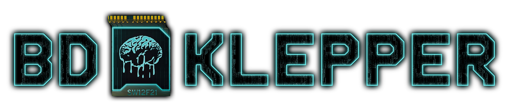

<p align="center">
A Cyberpunk 2077 Themed YT-DLP Wrapper
</p>

___

## About
This is a small yt-dlp wrapper built with Tauri, Vue.js. 

The interface is my attempt at recreating Cyberpunk 2077's menus as closely as I could.


## Features

* Download media with two modes possible
  * Single URL or Batch
* Cyberpunk 2077 UI
* Built with Tauri + Vue.js

## Why?

There exists a dozen of yt-dlp wrappers, but I wanted to make my own, to gather more experience with tools like VueJS and learning how Tauri works.

I also like to do things my way, and replicating the UI of my favorite game is also a plus, and makes my project stick out.


## Credits
* **References**: [Game UI Database](https://www.gameuidatabase.com/gameData.php?id=439)
* **App Font**: [Rajdhani](https://fonts.google.com/specimen/Rajdhani) from Google Fonts
* **Logo Font**: [KH Interference](https://khtype.com/typeface/kh-interference/) (trial)
* **Icon and Logo Brain**: Synapse Burnout Quickhack from the Cyberpunk 2077 game
* **yt-dlp bin**: [Github](https://github.com/yt-dlp/yt-dlp)

## Legal
```
Unofficial, non-commercial fan project. 
Not affiliated with or endorsed by CD PROJEKT RED. 
The Cyberpunk 2077 IP and assets belongs to its respective owners. 
Use yt-dlp responsibly and respect applicable copyright laws.
```